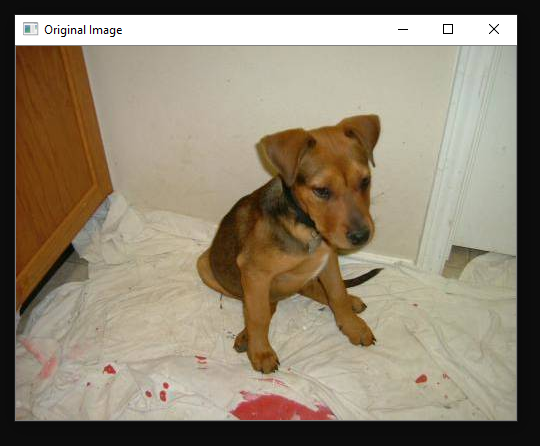
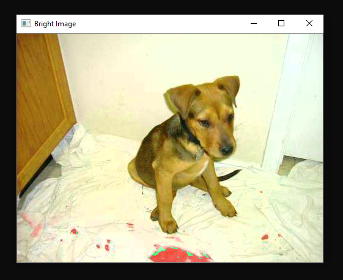
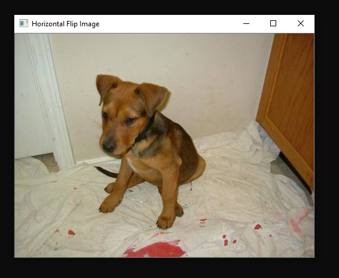
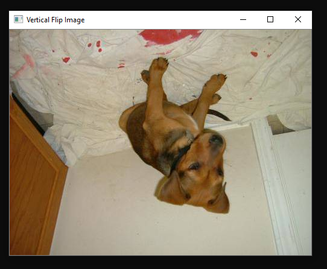
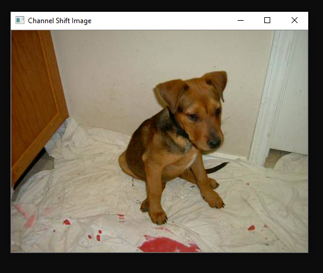
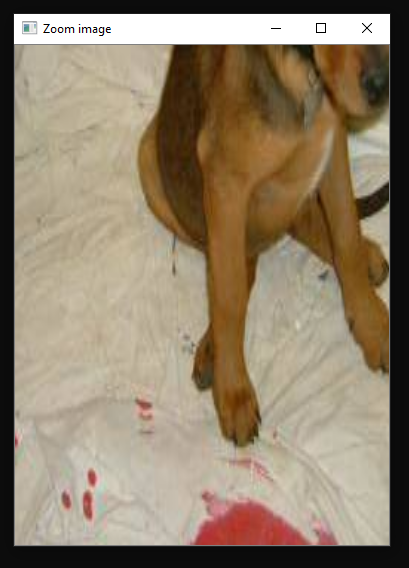
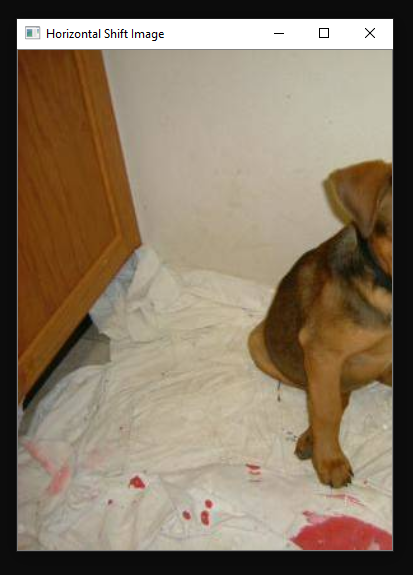
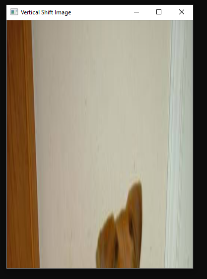
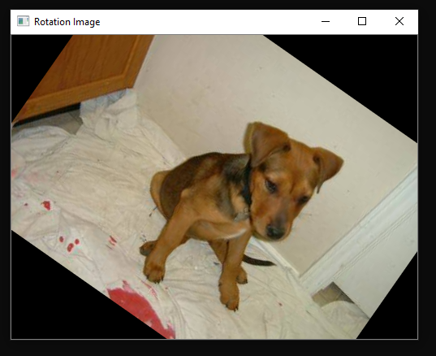

# OpenCV Image Augmenter

Steps to augment an image :

Run this in Annaconda prompt or whatever software you are using.

    python Image_Augmenter_code.py

Give your image path and then press enter
Then you will different augmented images like this : 

